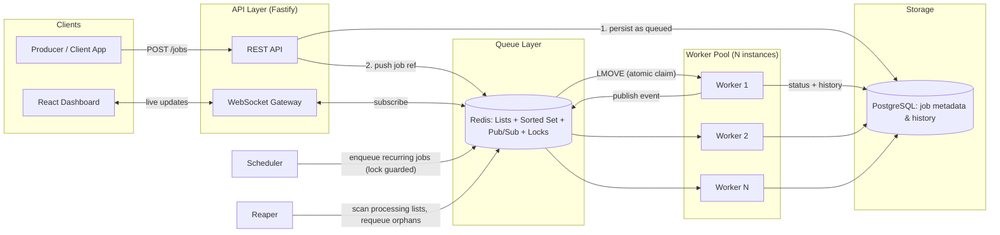
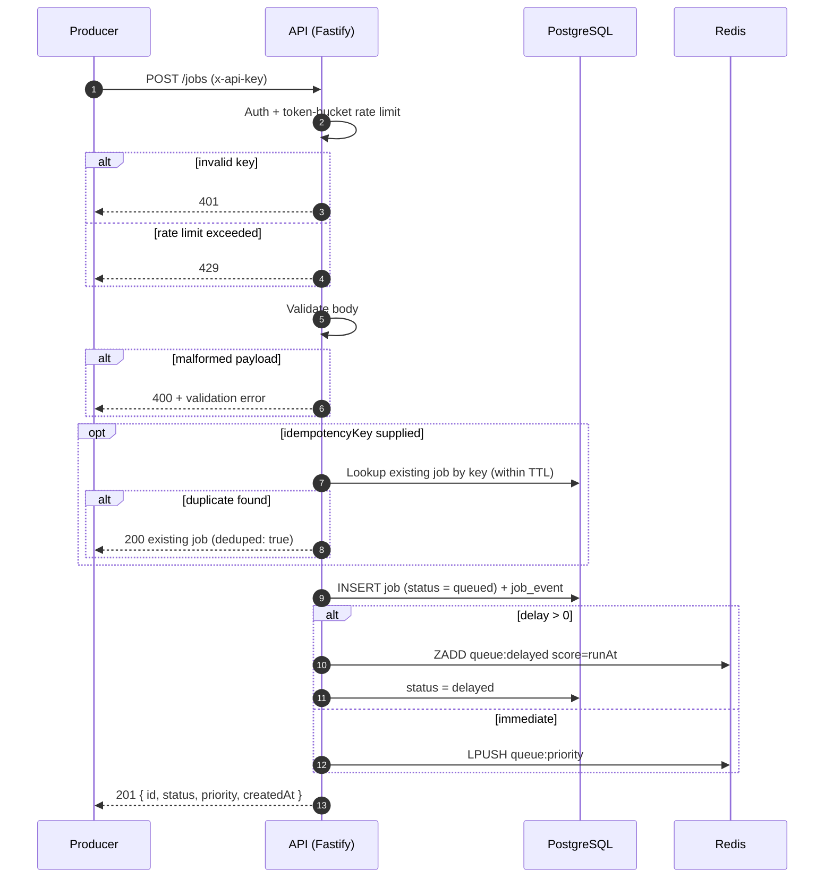
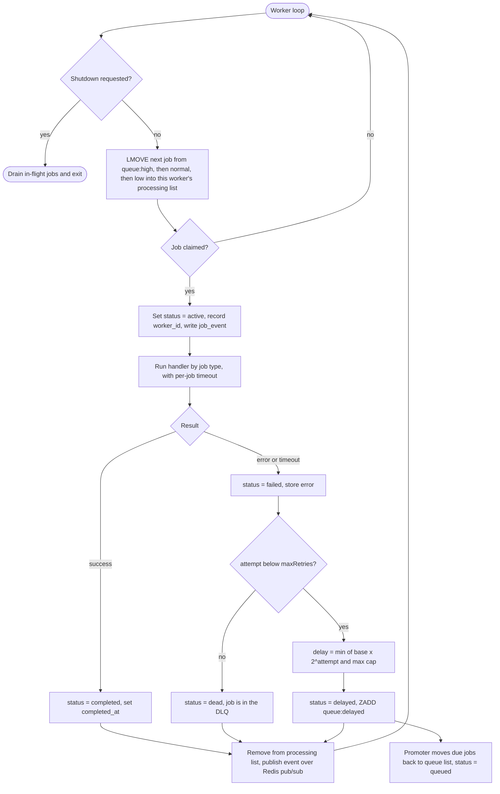
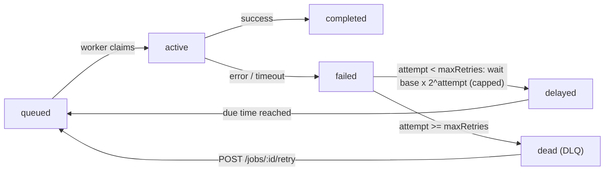
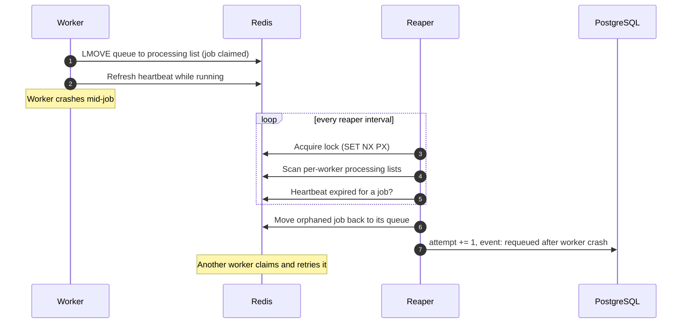
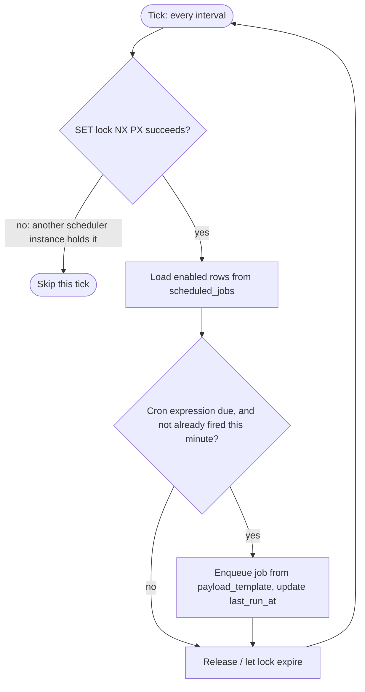
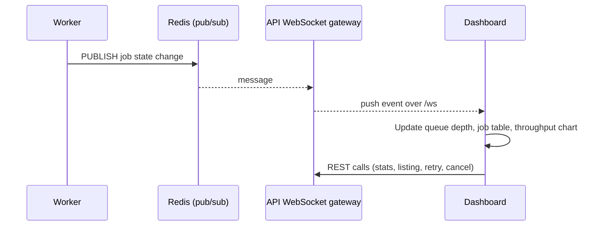
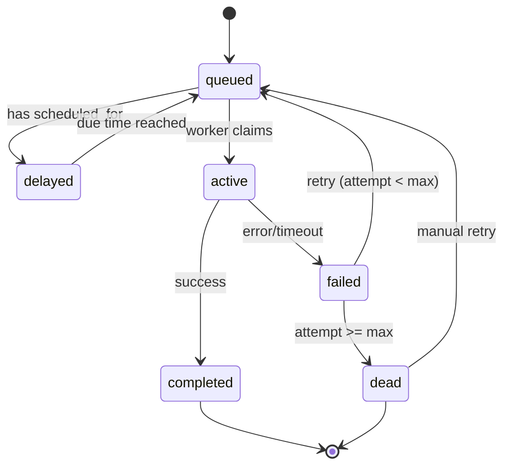
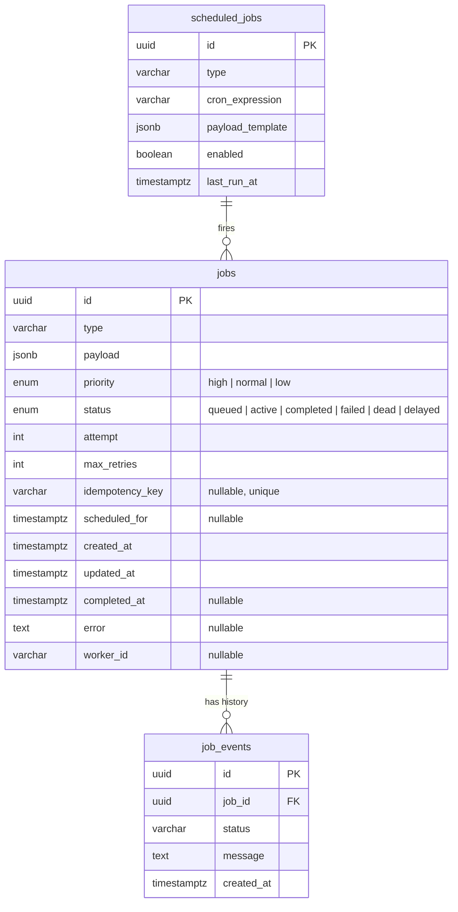

# Distributed Job Queue & Background Processing System

A backend-heavy async job processing system in the spirit of Sidekiq / Celery / BullMQ,
built from scratch on **Node.js, Fastify, Redis, and PostgreSQL**, with a live
**React** dashboard fed over **WebSocket**.

It implements the [SRS](./SRS_Job_Queue_System.md) (v1.0): priority queues,
delayed/scheduled jobs, exponential-backoff retries, a dead-letter queue (DLQ),
crash recovery, graceful shutdown, API-key auth with rate limiting, and real-time
monitoring.

> **Status:** implemented and smoke-tested end-to-end against real Redis and
> PostgreSQL instances (not mocked). See [What was actually run](#what-was-actually-run)
> and [Known gaps](#known-gaps--production-hardening-notes) for exactly what is and
> isn't covered.

## Table of contents

1. [Features](#1-features-srs-22--3)
2. [Architecture](#2-architecture-srs-5)
3. [Flow diagrams](#3-flow-diagrams)
4. [Job state machine](#4-job-state-machine-srs-appendix-a)
5. [Data model](#5-data-model-srs-6)
6. [Queue design](#6-queue-design-srs-53)
7. [API reference](#7-api-reference-srs-7)
8. [Non-functional requirements](#8-non-functional-requirements-srs-4)
9. [Project layout](#9-project-layout)
10. [Quick start](#10-quick-start)
11. [Trying it out](#11-trying-it-out)
12. [Configuration](#12-configuration-srs-102)
13. [Testing](#13-testing-srs-9)
14. [Deployment & CI/CD](#14-deployment--devops-srs-10)
15. [What was actually run](#what-was-actually-run)
16. [Known gaps / production hardening notes](#known-gaps--production-hardening-notes)
17. [Future enhancements](#17-future-enhancements-srs-11)

---

## 1. Features (SRS 2.2 & 3)

| Area | What it does | SRS |
|---|---|---|
| **Job submission** | `POST /jobs` with `type`, `payload`, `priority`, `delay`, `maxRetries`, `idempotencyKey`; malformed input rejected with `400` and a validation body; duplicate `idempotencyKey` within a TTL returns the existing job | FR-1 |
| **Queuing** | 3 priority levels (`high`, `normal`, `low`); delayed jobs run no earlier than `now + delay`; job is persisted to PostgreSQL as `queued` **before** it is pushed to Redis | FR-2 |
| **Processing** | Atomic claim via Redis `LMOVE` so no two workers ever run the same job; status transitions `queued → active → completed / failed`; per-job timeout (timed-out jobs are marked `failed` and retried) | FR-3 |
| **Retries & DLQ** | Exponential backoff `delay = base * 2^attempt` (capped at a max); after `maxRetries` the job becomes `dead` (DLQ); operators can re-queue via `POST /jobs/:id/retry` | FR-4 |
| **Scheduling** | Cron-style recurring jobs; a scheduler process fires them once per interval, guarded by a Redis lock so multiple scheduler instances never double-fire | FR-5 |
| **Monitoring** | `GET /jobs/:id`, `GET /jobs?status=&type=&page=`, live WebSocket events, dashboard with queue depth per priority, throughput, failure rate and DLQ count | FR-6 |
| **Graceful shutdown** | On `SIGTERM`, workers stop claiming and drain in-flight jobs within a grace period | FR-7 |
| **Auth & rate limiting** | `x-api-key` on every route; per-key token-bucket limiting returning `429` | FR-8 |
| **Crash recovery** | A reaper requeues jobs orphaned by crashed workers (at-least-once delivery) | NFR-3, 5.4 |

**Out of scope for v1** (SRS 1.2): multi-tenant billing, plugin marketplace, cross-language SDKs (Node only).

---

## 2. Architecture (SRS 5)

Three deployable process types sit beside the API: **worker**, **scheduler**,
**reaper**. Each scales independently
(`docker compose up --scale worker=5`).



### Component responsibilities (SRS 5.2)

| Component | Responsibility |
|---|---|
| **API Server** | Validation, auth, rate limiting, job persistence, enqueue to Redis, WebSocket fan-out |
| **Redis** | Queue storage (priority Lists, delayed Sorted Set), pub/sub for real-time events, distributed locks |
| **Worker Pool** | Atomic job claim, execution, retry/backoff logic, status reporting |
| **PostgreSQL** | Durable job history, audit trail, DLQ records, analytics queries |
| **Scheduler** | Fires recurring jobs on schedule; Redis lock prevents double-firing across instances |
| **Reaper** | Detects orphaned jobs from crashed workers and requeues them |
| **Dashboard** | Visualizes real-time and historical queue state |

**Source-of-truth rule (SRS 2.5):** Redis owns *queue state*; PostgreSQL owns
*historical / audit state*.

---

## 3. Flow diagrams

### 3.1 Job enqueue flow (FR-1, FR-2)



### 3.2 Worker processing flow (FR-3, FR-4)



### 3.3 Retry, backoff and DLQ flow (FR-4)



### 3.4 Crash recovery flow (NFR-3, SRS 5.4)



### 3.5 Scheduler flow (FR-5)



### 3.6 Graceful shutdown flow (FR-7)

```mermaid
sequenceDiagram
    participant OS as Orchestrator
    participant W as Worker
    participant PG as PostgreSQL

    OS->>W: SIGTERM
    W->>W: Stop claiming new jobs
    W->>W: Wait for in-flight jobs (grace period)
    alt all finished in time
        W->>PG: Final status updates
        W-->>OS: exit 0 ("All in-flight jobs finished cleanly.")
    else grace period exceeded
        W-->>OS: exit; unfinished jobs stay in processing list for the reaper
    end
```

### 3.7 Real-time dashboard flow (FR-6.3)



---

## 4. Job state machine (SRS Appendix A)



---

## 5. Data model (SRS 6)



**Indexes (SRS 6.4)**

| Index | Purpose |
|---|---|
| `jobs(status, priority, created_at)` | Dashboard / listing queries |
| `jobs(idempotency_key)` (unique, partial `WHERE NOT NULL`) | Idempotency dedup |
| `job_events(job_id, created_at)` | Job history lookup |

---

## 6. Queue design (SRS 5.3)

| Concern | Implementation |
|---|---|
| **Priority** | Three Redis Lists: `queue:high`, `queue:normal`, `queue:low`. Workers poll high → normal → low |
| **Delayed jobs** | Redis Sorted Set `queue:delayed`, scored by execution timestamp. A poller promotes due jobs into the active list |
| **Atomic claim** | `LMOVE` (Redis 6.2+) from the queue list to a per-worker processing list. No two workers can claim the same job, and the processing list enables crash recovery |
| **Distributed locks** | Scheduler and reaper use `SET key value NX PX <ttl>` so only one instance runs at a time |
| **Real-time events** | Redis pub/sub, fanned out to dashboards by the API's WebSocket gateway |
| **Delivery guarantee** | At-least-once. Handlers should be idempotent, or callers should supply an `idempotencyKey` |

---

## 7. API reference (SRS 7)

All authenticated routes require the `x-api-key` header (FR-8.1) and are
token-bucket rate limited per key (FR-8.2, `429` on excess).

| Method | Endpoint | Description | SRS |
|---|---|---|---|
| POST | `/jobs` | Enqueue a new job | FR-1 |
| GET | `/jobs/:id` | Job detail + event history | FR-6.1 |
| GET | `/jobs?status=&type=&page=` | List / filter jobs with pagination | FR-6.2 |
| POST | `/jobs/:id/retry` | Manually re-queue a DLQ / failed job | FR-4.3 |
| DELETE | `/jobs/:id` | Cancel a queued (not yet started) job | – |
| GET | `/queues/stats` | Queue depth, throughput, failure rate | FR-6.4 |
| POST | `/schedules` | Create a recurring job definition | FR-5.1 |
| GET / PATCH / DELETE | `/schedules[/:id]` | List / manage recurring definitions | – |
| WS | `/ws` | Real-time job / queue event stream | FR-6.3 |
| GET | `/health` | Container healthcheck | – |
| GET | `/metrics` | Prometheus-format metrics | SRS 10.4 |

**Sample request**

```json
POST /jobs
{
  "type": "send_email",
  "payload": { "to": "user@example.com", "template": "welcome" },
  "priority": "high",
  "maxRetries": 3,
  "idempotencyKey": "welcome-email-user-123"
}
```

**Sample response**

```json
{
  "id": "b3f1c9a0-...",
  "status": "queued",
  "priority": "high",
  "createdAt": "2026-09-23T10:00:00Z"
}
```

**Status codes:** `201` created · `200` deduped existing job · `400` validation error ·
`401` missing/invalid key · `429` rate limited · `503` when Redis is unavailable
(graceful degradation target, SRS 9.4).

---

## 8. Non-functional requirements (SRS 4)

| ID | Category | Requirement | Status in this repo |
|---|---|---|---|
| NFR-1 | Performance | ≥ 500 enqueues/sec (4 vCPU, 8 GB) | Target only. Load test not run (see [Testing](#13-testing-srs-9)) |
| NFR-2 | Latency | Enqueue → claim < 200 ms at p95 | Target only. Not yet measured |
| NFR-3 | Reliability | No job lost on worker crash (at-least-once) | Implemented via processing lists + reaper |
| NFR-4 | Scalability | Workers scale horizontally with zero config change | Implemented (`--scale worker=N`) |
| NFR-5 | Observability | Structured JSON logs for every state transition | Implemented |
| NFR-6 | Availability | API 99.5% uptime, single region | Deployment target |
| NFR-7 | Security | Secrets never logged or committed | Env-var based config, `.env` not committed |
| NFR-8 | Maintainability | ≥ 80% unit coverage on core queue logic | Unit tests for backoff, key scheme, claim ordering |
| NFR-9 | Data retention | Completed jobs kept 30 days, then purged | **Not yet implemented** as a running job (see gaps) |

---

## 9. Project layout

```
packages/
  shared/      Redis key scheme, backoff math, logger, used by every process
  db/          PostgreSQL schema.sql + migration runner
  server/      Fastify API: routes, auth, rate limiting, WebSocket gateway
  worker/      Claim/execute/retry loop, job handlers, graceful shutdown
  scheduler/   Cron-based recurring job firing (distributed lock)
  reaper/      Crash recovery (orphaned job requeue)
  dashboard/   React + Vite live dashboard
docker/        Dockerfiles + nginx config for the dashboard
tests/         Vitest unit tests (backoff, key scheme, claim priority ordering)
docker-compose.yml
```

---

## 10. Quick start

### Docker Compose (recommended)

```bash
cp .env.example .env   # edit if you want, defaults work out of the box
docker compose up --build
```

Starts Redis, PostgreSQL (+ migration), the API server, 2 worker replicas, the
scheduler, the reaper, and the dashboard.

- API: http://localhost:3000
- Dashboard: http://localhost:8080
- Default API keys: `dev-key-123`, `dev-key-456` (set in `docker-compose.yml`)

Scale workers independently:

```bash
docker compose up --scale worker=5
```

### Local (no Docker)

Requires Node 20+, Redis 7+, and PostgreSQL 15+.

```bash
npm install
cp .env.example .env
# create a `jobqueue` Postgres role/db matching DATABASE_URL, then:
npm run db:migrate

# in separate terminals:
npm run dev:server
npm run dev:worker
npm run dev:scheduler
npm run dev:reaper
npm run dev:dashboard   # http://localhost:5173, proxies /api to :3000
```

---

## 11. Trying it out

```bash
# Enqueue a job
curl -X POST http://localhost:3000/jobs \
  -H "x-api-key: dev-key-123" -H "Content-Type: application/json" \
  -d '{"type":"send_email","payload":{"to":"you@example.com","template":"welcome"},"priority":"high"}'

# Check its status
curl http://localhost:3000/jobs/<id> -H "x-api-key: dev-key-123"

# Queue stats (FR-6.4)
curl http://localhost:3000/queues/stats -H "x-api-key: dev-key-123"

# Create a recurring job (FR-5)
curl -X POST http://localhost:3000/schedules \
  -H "x-api-key: dev-key-123" -H "Content-Type: application/json" \
  -d '{"type":"noop","cronExpression":"*/5 * * * *"}'
```

### Watch the retry / backoff path live

The bundled `send_email` handler intentionally fails once when
`payload.template === "flaky-demo"`:

```bash
curl -X POST http://localhost:3000/jobs \
  -H "x-api-key: dev-key-123" -H "Content-Type: application/json" \
  -d '{"type":"send_email","payload":{"to":"x@y.com","template":"flaky-demo"},"maxRetries":2}'
```

On the dashboard you'll see it go
`queued → active → delayed (retry scheduled) → queued → active → completed`
over the WebSocket feed.

### Send a job straight to the DLQ

```bash
curl -X POST http://localhost:3000/jobs \
  -H "x-api-key: dev-key-123" -H "Content-Type: application/json" \
  -d '{"type":"send_email","payload":{},"maxRetries":0}'
# then re-queue it manually:
curl -X POST http://localhost:3000/jobs/<id>/retry -H "x-api-key: dev-key-123"
```

---

## 12. Configuration (SRS 10.2)

All secrets and config come from environment variables (`.env` locally, a secret
manager in production). See `.env.example` for every variable. Key ones:

| Variable | Purpose |
|---|---|
| `REDIS_URL` | Redis connection string |
| `DATABASE_URL` | PostgreSQL connection string |
| `WORKER_CONCURRENCY` | Jobs a single worker runs in parallel |
| `MAX_RETRIES_DEFAULT` | Default `maxRetries` when a job doesn't specify one |
| `RATE_LIMIT_PER_MIN` | Per-API-key token-bucket limit |

`.env.example` also covers ports, timeouts, backoff base/cap, and retention days.

---

## 13. Testing (SRS 9)

```bash
npm test   # Vitest unit tests
```

Unit tests (SRS 9.1) cover backoff math, the Redis key scheme, and `claim()`
priority-ordering logic against an in-memory fake Redis (`tests/claim.test.js`).

### Coverage vs. the SRS testing strategy

| SRS section | Test type | Status |
|---|---|---|
| 9.1 | Unit (priority order, backoff, idempotency, API validation) | Partially implemented (backoff, key scheme, claim ordering) |
| 9.2 | Integration (Testcontainers: API → Redis → Worker → Postgres, concurrent-claim race, kill-and-recover) | Specified, **not included**: needs ephemeral Redis/Postgres containers |
| 9.3 | Load (k6 / Artillery: 500/sec enqueue, 10k burst drain, 50 WS clients) | Specified, **not included** |
| 9.4 | Chaos (Redis drop → `503`, worker kill, Postgres restart) | Specified, **not included** |
| 9.5 | E2E (Playwright/Cypress: submit → watch states live on dashboard) | Specified, **not included** |

### Acceptance criteria (SRS 9.6)

| Test case | Expected result | Status |
|---|---|---|
| Duplicate idempotency key within TTL | Second request returns the existing job | Manually verified (`deduped: true`) |
| Job fails until `maxRetries` exhausted | Status becomes `dead`, appears in DLQ | Manually verified (`maxRetries: 0` path, plus manual re-queue) |
| Worker killed mid-execution | Job reappears in queue within reaper interval and is retried | Logic implemented; automated kill test pending |
| Requests above the rate limit from one key | `429` | Implemented; not load-tested |
| Recurring job, multiple scheduler instances | Fires exactly once per interval | Single-fire verified at the minute boundary; multi-instance test pending |

---

## 14. Deployment & DevOps (SRS 10)

- **Local:** Docker Compose (API, worker ×2, Redis, PostgreSQL, scheduler, reaper, dashboard).
- **Production:** containerized (e.g. Fly.io / Render / AWS ECS) with an
  independently scalable worker replica count. TLS terminates at the reverse
  proxy / load balancer; Redis and PostgreSQL traffic stays on a private network.
- **CI/CD (target):** GitHub Actions: lint → unit tests → integration tests (service
  containers) → build Docker images → deploy on merge to `main`.
- **Monitoring:** structured JSON logs to a log aggregator; `/metrics` exposes queue
  depth, throughput and error rate in Prometheus format for future Grafana use.

---

## What was actually run

During development this system was:

1. Migrated against a real PostgreSQL 16 instance (`npm run db:migrate`).
2. Booted as a real Fastify server against real Redis + PostgreSQL.
3. Exercised via `curl`: job enqueue, idempotency dedup (second call returned the
   same job with `deduped: true`), queue stats, job detail with full event history.
4. A real worker process claimed and completed jobs, including the full
   fail → backoff-delay → auto-promote → retry → succeed path for a job designed
   to fail on its first attempt.
5. A job with `maxRetries: 0` and an invalid payload was pushed straight to the
   dead-letter queue (`status: "dead"`), then successfully re-queued via
   `POST /jobs/:id/retry`.
6. The scheduler fired a `* * * * *` recurring job exactly once at the minute
   boundary (no double-fire).
7. `SIGTERM` sent to the worker triggered a clean drain-and-exit per FR-7,
   logging "All in-flight jobs finished cleanly."

---

## Known gaps / production hardening notes

- **WebSocket auth:** `/ws` doesn't require an API key in v1 (assumed to sit behind
  the same network boundary as the dashboard). Add a signed short-lived token or
  session check before exposing it publicly.
- **Postgres → Redis write gap:** per FR-2.3 a job is written to PostgreSQL before
  being pushed to Redis. If the process crashes between the two writes, the job
  exists as `queued` in Postgres but never reaches Redis, and there is no automatic
  reconciler in v1. A production version should add a periodic job that finds
  `status='queued'` rows older than N seconds with no Redis entry and re-pushes them.
- **Single Redis instance:** per SRS 2.6 there is no Sentinel/Cluster failover in v1.
- **Worker registry pruning:** `workers:active` entries aren't pruned if a worker
  crashes without deregistering. Harmless (scanning an empty processing list is
  cheap) but unbounded over a very long-lived deployment. A TTL'd worker-liveness
  heartbeat is the natural follow-up.
- **Retention cleanup (NFR-9):** not implemented as a running process. Add a
  scheduled `DELETE FROM jobs WHERE status='completed' AND completed_at < now() - interval '30 days'`
  (via the scheduler or a dedicated cleanup script) before production use.
- **Integration / load / chaos / E2E suites** (SRS 9.2–9.5) are not implemented as
  runnable test files in this deliverable.

---

## 17. Future enhancements (SRS 11)

- Redis Cluster support for horizontal broker scaling
- Multi-tenant namespacing (per-client queues)
- Plugin system for dynamically loaded custom job-type handlers
- BullMQ-based alternate backend for performance comparison
- gRPC producer interface alongside REST

---

*Requirements are defined in [SRS_Job_Queue_System.md](./SRS_Job_Queue_System.md) (v1.0).
Requirement IDs (FR-x, NFR-x) referenced above map directly to that document.*
